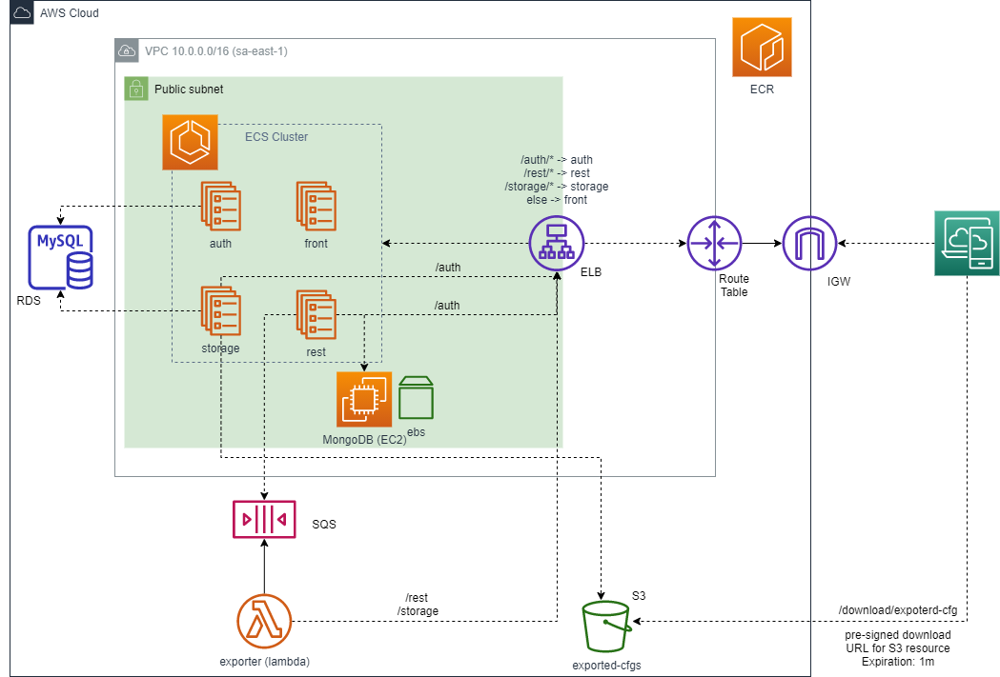
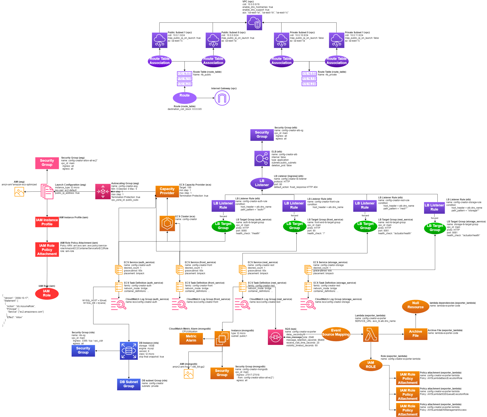

# Config Creator
Config Creator is a Web Application aimed to make it easy to create forms for inputting and exporting configuration
of any kind.

## Brief
The original idea of this project came from my constant need to create JSON configurations by hand for my game projects.
When I first created a solution to solve part of this problem, I came with [npc-data-manager](https://github.com/dendriel/npc-data-manager-rest)
that allowed to create fixed types of data.

In this scenario, when I needed to add a new type of data, although the code was generic, I still had to
copy/past some code and rebuild/repack everything. It was horrible.. =p

I know and I feel the project cold have just frontend and backend service. But I deliberately created and included other
services to have a microservices scenario I could use to deploy in AWS to study its services.

## Concepts

- Base types - are the input fields that the user interacts with. May be of different types:
    - text;
    - textArea;
    - number;
    - toggle;
    - list.
- Templates - group any number of base types to create a more meaningful type. Can group:
    - Base types;
    - Other templates.
- Project - is the workspace where it is possible instantiate templates in the form of Items and Collections (aka resources)
- Items - a unique data field in the project. Can be a base type or a template
- Collections - a list in the project that hold many Items of a base type (except for list) or template
- Configuration - the result of exporting the data contained in a project. After created, is available to download
in JSON format.


## Usage

To use Config Creator, first create a Project, then add resources to it. Templates can be created independently of projects
and can be added to project as resources. After the project is created, it will be automatically displayed in the Home page.

To start feeding data into the project, access the Home page and fill an Item or select a Collection and create a new Item
inside the collection.

To export the project data, access the configuration page and click in the 'Generate' button. It will create an export request
of the project in use. When the project data has been exported, the project entry in the listing from configuration page will
active the download button to retrieve the exported data.

Project related pages automatically loads data from the active project. So the project listing page allows to select
the active project for the current user.


## Run with docker-compose

Setup:

- Setup AWS credentials and configure the `storage-service` volume mapping to the credentials folder
  - Default volume mapping is `c:\.aws:/root/.aws:ro`

Boot the infra:
```shell
docker-compose up
```

Credentials:
- Username: root
- Password: dendriel

Docker-compose will create the following containers:

- config-creator_front-service - nginx server with static files from react-app + rules to proxy requests to rest, auth and storage services;
- config-creator_rest-service - rest server with CRUD APIs; also, enqueue export requests via sqs-service;
- config-creator_storage-service - stores exported configurations in a AWS S3 bucket;
- config-creator_auth-service - used by login and by backend services to authenticate requests;
- config-creator_exporter-service - exports projects configurations (meant to be a lambda when deploying on AWS);
- config-creator_mongo-service - stores project data;
- config-creator_mysql-service - stores user authentication data and storage-service related data;
- config-creator_sqs-service - allows to enqueue/dequeue configuration export requests.


Stop and remove all containers:
```shell
docker-compose stop && docker-compose rm
```

## Run with terraform

Terraform creates all needed infra to run Config Creator in AWS Cloud. Its only required to setup AWS credentials so
terraform can communicate with AWS. Check AWS docs on how to setup the credentials: https://docs.aws.amazon.com/sdk-for-java/v1/developer-guide/setup-credentials.html

**Warning**: terraform launch create many network resources and links, but it has some problems when shutting down
the setup. Some resources may have to be removed manually. So use terraform only if you are confident you can remove
some resources manually. 

From `terraform/` directory:

Create the infrastructure:
```shell
terraform apply
```

List everything created and managed by terraform:
```shell
terraform state list
```

Destroy the infrastructure:
```shell
terraform destroy
```

To allow rest-service to connect to SQS, we need to specify `aws_access_key_id` and `aws_secret_key` when applying. Another way to provide 
these credentials is via environment variables using `TF_VAR_aws_access_key_id` and `TF_VAR_aws_secret_key`.


Resources that may have to be deleted manually - wait for ECS cluster deletion to get stuck before deleting those:

- ECS cluster;
- Auto scaling group.

Misc:
- aws_db_instance termination takes many minutes;
- aws_vpc termination got stuck only once for me. But it was the last resource and removing it via AWS console is trivial.

### Solution Diagram
AWS deploy solution architecture.


Initially, I did deploy everything inside a private subnet, but it requires a NAT gateway and many VPC endpoints which are expensive.
**TODO: deploy inside a private subnet by replacing the NAT gateway by NAT instance inside.**

### Resources Diagram

Visual representation of everything created/configured via terraform deploy in aws:



